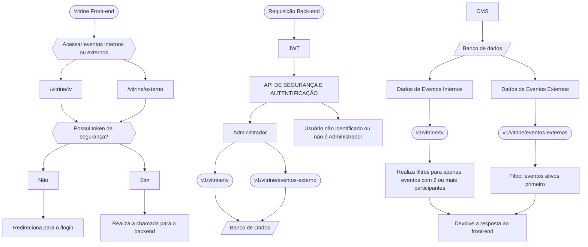

<p align="center">
  <a href="https://fatecregistro.cps.sp.gov.br/" target="blank"></a>
</p>

  <p align="center">Laboratório de Práticas é de realização da <a href="https://fatecregistro.cps.sp.gov.br/" target="_blank">Fatec Registro</a> com o objetivo de acrescentar aos alunos um portfólio, e não menos importante, experiência!</p>
    <p align="center">
<a href="https://www.instagram.com/fatecregistro/" target="_blank"></a>
</p>

<h1 align="center">Vitrine - BackEnd</h1>

## 📋 Descrição
API desenvolvida com Nest.js que gerencia a apresentação de candidatos para representante e de Projetos da Fatec Registro. Através de QR codes únicos cada voto é encaminhado para a página correspondente ao candidato escolhido, garantindo transparência e acessibilidade durante o processo eleitoral da Faculdade.

### ⚙ O sistema oferece:

- Apresentação de candidatos e projetos através de vitrine digital

- Geração de QR codes únicos para cada representate

- Integração segura com o sistema de votação

- Busca de eventos externos

- Consumo de informações providos pelo CMS através do Banco de Dados

## 🛠 Requisitos Técnicos

### Ambiente de Desenvolvimento
- [](https://nodejs.org/pt): v22.x (LTS recomendado)

- npm: v10.x ou Yarn

- []: v16+ (banco de dados principal)

- [](https://nestjs.com/): v11.0.0

- [](https://www.typescriptlang.org/): v5.7.3

## Dependências Principais

### Backend:

- @nestjs/common: v11.0.1

- @nestjs/jwt: v11.0.0 (autenticação)

- @nestjs/typeorm: v11.0.0 (ORM)

- typeorm: v0.3.21

- pg: v8.14.1 (driver PostgreSQL)

- @nestjs/swagger: v11.1.0 (documentação API)

## Segurança
- Autenticação JWT (JSON Web Tokens)

## Configuração do Ambiente
Instalação
```bash
git clone https://github.com/laboratorio-de-praticas/vitrine-be.git

cd vitrine-be

npm install

cp .env.example .env
```

## Variáveis de Ambiente (.env)

### Configurações do servidor
```bash
PORT=5001
NODE_ENV=development

### Banco de dados
DB_HOST=nome_do_host
DB_PORT=porta
DB_USERNAME=nome_do-usuario
DB_PASSWORD=senha
DB_DATABASE=nome_do_banco

### Frontend 
FRONT_END_HOST=http://localhost:3001
```


## Scripts Disponíveis
- `npm run build`: Compila o projeto usando o Nest
- `npm run format`: Formata o código usando Prettier
- `npm run start`: Inicia o servidor em modo normal
- `npm run start:dev`: Inicia o servidor em modo de desenvolvimento com hot-reload
- `npm run start:debug`: Inicia o servidor em modo de depuração
- `npm run start:prod`: Inicia o servidor em modo de produção
- `npm run lint`: Executa o ESLint para correção de código
- `npm run test`: Executa os testes unitários
- `npm run test:watch`: Executa os testes em modo observador
- `npm run test:cov`: Executa os testes com cobertura
- `npm run test:debug`: Executa os testes em modo de depuração
- `npm run test:e2e`: Executa os testes end-to-end

## Estrutura do Projeto 
```
src/
├── controllers/     # Controladores da aplicação
├── dto/             # Objetos de transferência de dados
├── entities/        # Entidades do banco de dados
├── modules/         # Módulos NestJS
├── providers/       # Provedores de serviços
├── middlewares/     # Middlewares personalizados
├── repositories/    # Repositórios para acesso a dados
├── services/        # Serviços de negócios
├── utils/           # Funções utilitárias
└── main.ts          # Ponto de entrada da aplicação
```

## Endpoints Principais

### Representantes
Método GET
→ Endpoint: /v1/vitrine/tv
→ Descrição: Lista todos os eventos internos ativos no momento, com o número de representantes >=2
→ Autenticação: Nível Administrativo

## Segurança
### Camadas de Proteção

- CORS: Restrito ao domínio do frontend

## Testes
- Cobertura garantida por:

- Testes unitários (Jest)

```bash
npm run test:cov  # Gera relatório de cobertura
```


## Diagramação - Vitrine 


